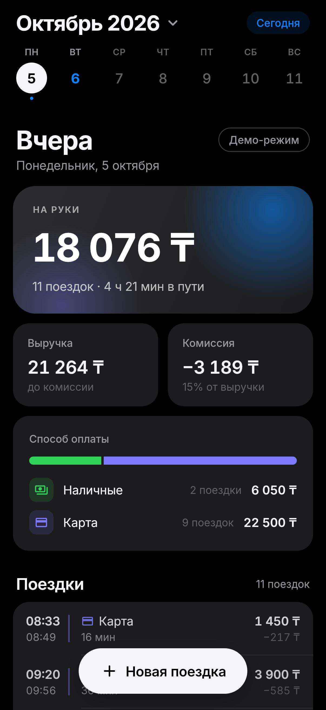
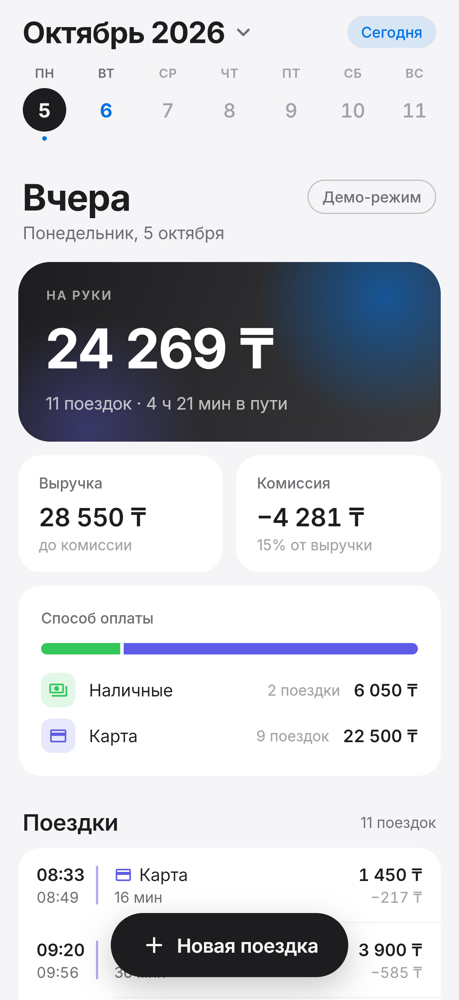
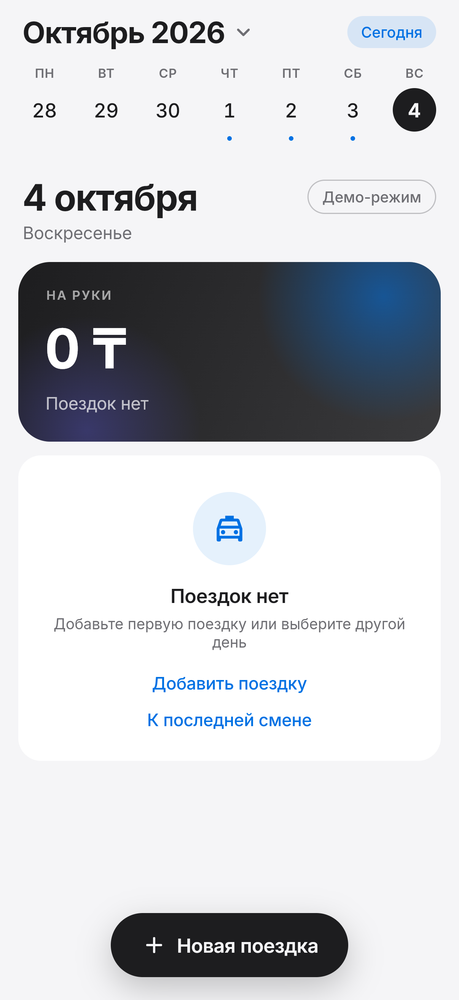

# Дневник смен водителя

Приложение для водителя такси: сводка за день (выручка, комиссия, сколько остаётся на руки, наличные и карта), список поездок и добавление новой поездки.

- **Сервер:** Python 3.12, FastAPI, чистая архитектура, хранение в JSON-файле.
- **Клиент:** Flutter 3.47 (iOS, Android, Web), Riverpod, своя дизайн-система в стиле Apple, светлая и тёмная темы.
- **Веб-демо:** https://nurzhauganova.github.io/drivers_shift_log/ (работает без сервера, подробности ниже).

| День | Поездки | Тёмная тема | Новая поездка | Пустой день |
|---|---|---|---|---|
|  |  |  |  |  |

## Что сделано

**По заданию**
- API отдаёт поездки за выбранный день и сводку: число поездок, выручка, комиссия, на руки, разбивка наличные/карта.
- Клиент показывает сводку и список, дни переключаются лентой недели, свайпом, стрелками клавиатуры или выбором даты.
- Добавление поездки через API с проверкой: сумма больше нуля, окончание позже начала, комиссия от 0 до суммы.
- Повторная отправка той же поездки не создаёт дубль, в том числе при одновременных запросах.
- Тесты на расчёт сводки и защиту от дублей на сервере и на клиенте.

**Сверх задания (небольшое и по делу)**
- Защита от пересечения поездок по времени: водитель не может везти двух пассажиров одновременно. Это ловит повторную отправку, если у неё случайно оказался новый id.
- Время в пути за день, отметки дней со сменами в календаре, при запуске открывается последняя смена.
- Комиссия в форме подставляется как 15% от суммы (так в примере данных), её можно изменить.
- После обрыва связи форма предлагает «Повторить» и отправляет тот же id, поэтому повтор безопасен.

## Быстрый старт

### Сервер

Нужен [uv](https://docs.astral.sh/uv/) (`brew install uv`).

```bash
cd backend
uv sync
uv run uvicorn shift_log.main:app --reload --port 8000
```

Документация API: http://localhost:8000/docs

Или через Docker:

```bash
docker compose up --build
```

### Клиент

Нужен Flutter 3.47+ (`flutter --version`).

```bash
cd mobile
flutter pub get

# С сервером: веб
flutter run -d chrome --dart-define=API_BASE_URL=http://localhost:8000

# С сервером: Android-эмулятор (10.0.2.2 это localhost хост-машины)
flutter run -d emulator-5554 --dart-define=API_BASE_URL=http://10.0.2.2:8000

# С сервером: iOS-симулятор
flutter run -d "iPhone 17" --dart-define=API_BASE_URL=http://localhost:8000

# Без сервера, демо-режим
flutter run -d chrome
```

### Тесты и проверки

```bash
cd backend && uv run pytest && uv run ruff check src tests && uv run mypy src tests
cd mobile && flutter test && flutter analyze
```

Те же проверки запускаются в GitHub Actions на каждый push. После успешной сборки `main` веб-демо публикуется на GitHub Pages.

## API

Базовый путь `/api/v1`. Деньги в целых тенге, время в ISO 8601 со смещением.

| Метод | Путь | Что делает |
|---|---|---|
| `GET` | `/trips?date=2026-10-01` | Поездки, начавшиеся в этот день |
| `GET` | `/summary?date=2026-10-01` | Сводка за день |
| `GET` | `/days/2026-10-01` | Сводка и поездки одним запросом (его использует клиент) |
| `GET` | `/days` | Дни, в которых есть поездки, от новых к старым |
| `POST` | `/trips` | Добавить поездку |

Ответы `POST /trips`:

| Код | Когда |
|---|---|
| `201 Created` | Поездка сохранена |
| `200 OK` + заголовок `Idempotent-Replayed: true` | Точно такая же поездка уже была, ничего не изменилось |
| `409 Conflict`, `trip_id_conflict` | Этот id уже занят поездкой с другими данными |
| `409 Conflict`, `trip_overlap` | Пересекается по времени с другой поездкой |
| `422`, `invalid_trip` / `validation_error` | Нарушены правила или формат, в `fields` указаны поля |

Пример:

```bash
curl -X POST localhost:8000/api/v1/trips -H 'Content-Type: application/json' -d '{
  "id": "t100", "start": "2026-10-06T10:00:00+05:00", "end": "2026-10-06T10:25:00+05:00",
  "amount": 2200, "payment": "cash", "commission": 330}'
```

## Архитектура

```
backend/src/shift_log/
  domain/          Trip, PaymentMethod, расчёт сводки, доменные ошибки. Без зависимостей от фреймворков.
  application/     Сценарии: GetDayReport, ListShiftDays, AddTrip. Порт TripRepository.
  infrastructure/  Репозитории: в памяти и в JSON-файле.
  api/             FastAPI: схемы, роуты, единый формат ошибок, сборка зависимостей.

mobile/lib/src/
  core/            Конфиг, время и календарь водителя, форматирование, тема, общие виджеты.
  features/shift/
    domain/        Модели, черновик поездки с валидацией, типизированные ошибки, интерфейс репозитория.
    data/          HTTP-репозиторий и демо-репозиторий, маппинг JSON.
    presentation/  Состояние (Riverpod), экран дня, форма добавления, виджеты.
```

Зависимости направлены внутрь: домен не знает про FastAPI и JSON, сценарии работают с портом репозитория. Поэтому хранилище меняется на PostgreSQL заменой одного класса, а бизнес-правила тестируются без HTTP.

## Принятые решения

**Граница дня.** Поездка относится к дню, в который она началась, по времени водителя (`Asia/Almaty`, UTC+5). Ночная поездка с 23:48 до 00:14 попадает в предыдущий день. Такая есть в демо-данных, в списке у неё отметка `⁺¹`. Клиент показывает время в зоне водителя независимо от часового пояса устройства, поэтому проверяющий из другой зоны видит те же 08:10.

**«На руки»** считается как выручка минус комиссия. Разбивка показывает, сколько из выручки пришло наличными и сколько картой.

**Идемпотентность.** Клиент генерирует UUID при открытии формы и отправляет его как `id` поездки. При повторе после обрыва связи уходит тот же id, и сервер отвечает `200` с уже сохранённой поездкой. Если водитель изменил данные, форма создаёт новый id, потому что это уже другая поездка. Проверка «есть ли такой id» и запись выполняются под одной блокировкой, тест с 16 параллельными потоками это подтверждает.

**Сравнение повторов** идёт по моменту времени, а не по строке: `08:10+05:00` и `03:10Z` считаются одной поездкой.

**Деньги** хранятся целыми числами. `2400.0` и `"2400"` сервер отклоняет: молча округлять деньги нельзя.

**Хранилище.** JSON по условию задания. Исходный файл `data/seed_trips.json` не изменяется, рабочие данные пишутся в `var/trips.json` атомарно (временный файл, затем `os.replace`). Если запись на диск не удалась, поездка не остаётся в памяти. Решение рассчитано на один процесс сервера. Для нескольких инстансов нужна БД с уникальным ключом по id.

**Демо-режим.** GitHub Pages отдаёт только статику, поэтому веб-демо собирается без `API_BASE_URL` и работает с демо-репозиторием в памяти браузера. Он повторяет правила сервера (группировка по дням, валидация, идемпотентность, пересечения), а CI проверяет, что его данные совпадают с данными сервера. На экране есть плашка «Демо-режим». Полноценный режим включается одним параметром сборки.

## Как использовался ИИ

Код писался вместе с Claude Code: я ставил задачу и принимал архитектурные решения, ИИ генерировал код и тесты. Каждый результат я проверял тестами, линтерами (ruff, mypy strict, flutter analyze со строгими правилами) и скриншотами реального приложения в браузере. Ошибки ИИ, которые нашлись и были исправлены:

1. **Полоса «наличные/карта» рисовалась наполовину.** Сегмент карты был `ColoredBox` без дочернего виджета внутри `Row`, и Flutter давал ему нулевую высоту. Тесты прошли, а на скриншоте была видна только зелёная часть. Исправлено через `CrossAxisAlignment.stretch`. Та же ошибка с нулевой шириной была у пустой дорожки.
2. **Гонка при запуске.** Если открыть форму до ответа `/days`, экран под ней переключался на последнюю смену, а форма предлагала время сегодняшнего дня, и поездка сохранялась не в тот день. Нашлось при сквозном прогоне клиента с настоящим FastAPI. Исправлено: открытая форма фиксирует день. Добавлен тест.
3. **«Октябрь 2026 г.»** ИИ убирал « г.» через `replaceAll(' г.', '')`, но intl ставит там неразрывный пробел, и замена не срабатывала. Тест поймал, исправлено шаблоном `LLLL y`.
4. **Заголовок обрезался до «Октябрь 2…»** на ширине iPhone из-за плашки «Демо» в шапке. Плашка перенесена к заголовку дня, строки сделаны гибкими под крупный системный шрифт.
5. **Android-релиз не ходил бы в сеть.** Шаблон Flutter объявляет разрешение `INTERNET` только в debug-манифесте. Добавлено в основной манифест, плюс разрешён HTTP к локальному серверу в debug-сборке и на iOS (`NSAllowsLocalNetworking`).
6. **Устаревшие зависимости.** Starlette предупреждала, что `httpx` в TestClient устарел. Заменено на `httpx2`.

## Структура репозитория

```
backend/      FastAPI-сервер, тесты, Dockerfile, демо-данные
mobile/       Flutter-клиент
docs/         Скриншоты
.github/      CI: проверки и деплой веб-демо
```
